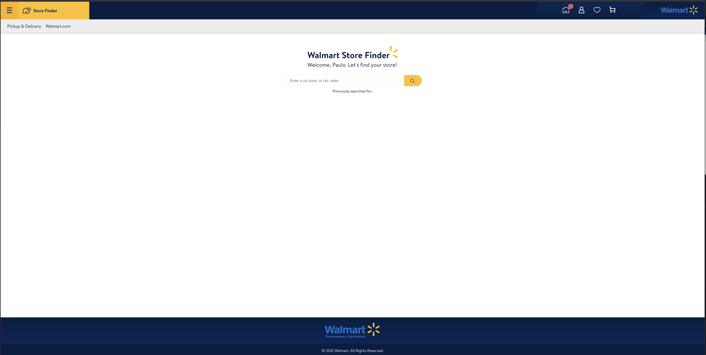
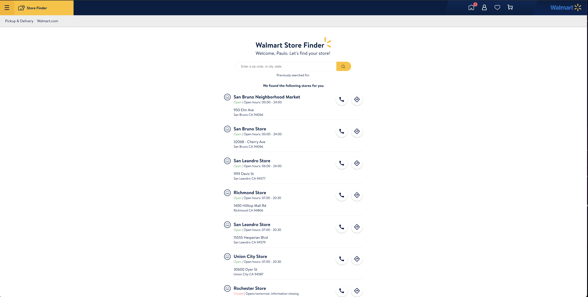
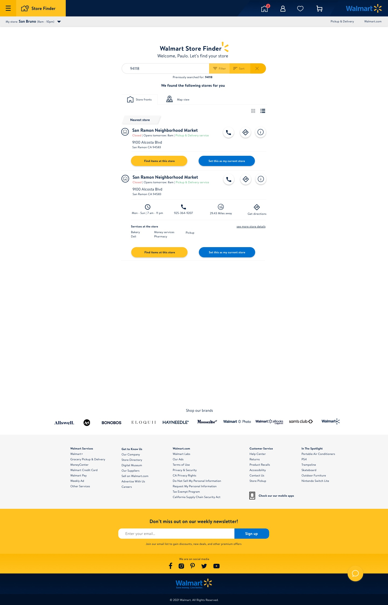
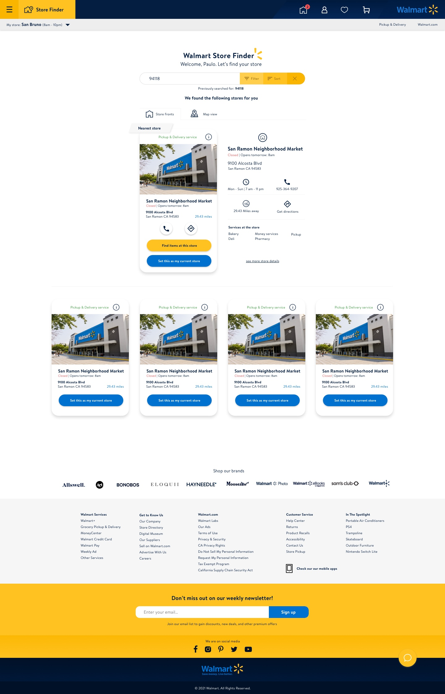

# About this project

> Disclaimer: This project was a full day of work where design, frontend, and backend code were thrown out. My overall goal was to be able to finish this on a day without it looking like a garbage dump and have code like one :)

To get this project started, I needed to get inspiration from design and UX, so I visited Walmart and a bunch of other online shopping websites to get a fresh new idea of how a user can search for a store.

I then sat down and wrote down my ideas and started to sketch on Sketch, the design program. I like to do this for challenges like these as it makes me feel like I'm more in line with the product itself.

I started to play around and investigate the GraphQL playground to get a sense of what data I can get and what I can do with it. I still have a bunch of learning to do as I don't know all the terminology that is being used. But, I did have a lot of fun exploring that playground.

Once I had a good idea, I decided to make my own contracts between the frontend and backend, not that I should, but I did it to showcase that if needed, I could. As the GraphQL API is public, there is no data I need to hide. When I read the description for the challenge, I understood it as it should be a RESTful API for the client and not a GraphQL API, so I worked from that understanding. If I were to have a GraphQL API I would probably have gone with Apollo for the client and the server.

For the application on both the front- and backend, I decided to go with Typescript. Nothing crazy, just enough to make it a little bit more type-safe. The frontend was built from create-react-app with redux.

## High latency zip codes

In the challenge, it was mentioned that a set of zip codes needed to have low response time and high uptime. This was a fun little though twister.

I started to think about what I would do if I could choose, but also what is more applicable to this challenge. Here are the ideas that I was thinking.

### Schedule a timed cloud function

I was thinking that a cloud function (or a cron job) should run a script that fetches the data for the zip codes mentioned and then write them as files to be served via CDN.

### Serve the zip codes results from Redis

Another idea that came to mind was to serve it from Redis. I thought that it could be an option if we already had that architecture implemented, but I decided to not go down that path for now for just a few zip codes.

### Have files being generated with the frontend build

I also thought that an interesting approach might have been to actually write files for the data when we are building the frontend. As I didn't want the user to have too many assets, I really didn't see this as a scalable solution for now.

### Finally, a decent solution to rule them all (maybe?)

I must admit that I started to think more and more about the scheduling of writing files, but I didn't have a CDN. So, I ended up writing a script file in the server that can be run with an npm command `npm run zipCodes` and it will fetch the data for the zip codes that were mentioned and write it to `JSON` files in the static folder in the server code.

I found this is a middle-ground that wouldn't cost much to move if needed to scale and maintained.

This script file is intended to be in the CI. Every time the repo is being built, we could write the files with updated data. As physical stores aren't built every day, I thought that we are pretty safe as long as we have a recurring build happening every day or two.

## Design

Here are some of the ideas that I was playing around with. The challenge is not implementing all of these features, but I needed to have them to be a bit more inspired about the product or service itself.

### End results

### The Concept

## How to start the project

First, install all dependencies and start the server and then the client. That is it. Easy as always with Node.

## Questions

If you have any questions, please reach out to me and I'm more than happy to talk about the thought process here, design, code design, and why I didn't to X or Y.

paulo.sandsten@gmail.com
